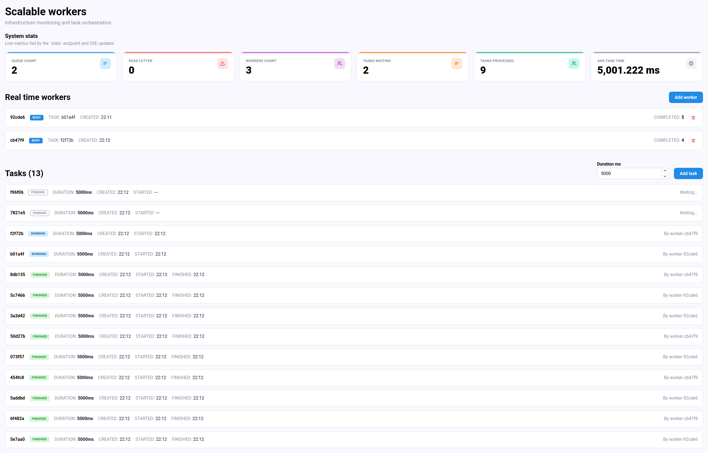

# Scalable Workers

Scalable Workers is a small distributed task processing dashboard. It lets you create timed tasks, start and stop worker runtimes, and monitor processing state in real time from a React UI.



## What It Does

- Creates tasks with a configurable duration.
- Starts workers as Docker containers from the backend.
- Sends tasks through RabbitMQ so available workers can process them.
- Stores tasks and workers in PostgreSQL.
- Keeps live counters in Redis.
- Streams task, worker, and stats updates to the frontend through SSE.
- Shows current queue depth, processed tasks, waiting tasks, active workers, and average processing time.

## Architecture

The repository is an Nx/Bun monorepo split into apps and shared packages:

- `apps/frontend`: React dashboard.
- `apps/backend`: Elysia API that exposes tasks, workers, stats, and SSE endpoints.
- `apps/task-worker`: worker runtime that consumes queued tasks.
- `packages/services`: business logic for tasks, workers, stats, and Redis events.
- `packages/drizzle`: PostgreSQL schema and Drizzle setup.
- `packages/common`: shared constants and types.
- `packages/infra`: Redis, logging, and infrastructure helpers.
- `packages/scripts`: local maintenance scripts.

Runtime dependencies are provided by Docker Compose:

- PostgreSQL for persisted workers and tasks.
- Redis for live stats and pub/sub events.
- RabbitMQ for task distribution.

## Local Setup

Install dependencies:

```sh
bun install
```

Create your local environment file:

```sh
cp .env.exemple .env
```

Start the infrastructure:

```sh
docker compose up -d
```

Apply the database schema:

```sh
bun run db:push
```

Start the development apps:

```sh
bun run dev
```

The frontend runs through Vite and proxies `/api` requests to the backend.

## Useful Commands

```sh
bun run build
bun run lint
bun run db:studio
bun run scripts:reset
```

## Worker Lifecycle

Workers are managed from the backend:

1. The UI calls `POST /workers`.
2. The backend creates a worker row in PostgreSQL.
3. The backend starts a Docker container for that worker.
4. The worker registers itself, consumes tasks from RabbitMQ, and publishes status updates.
5. The UI receives live changes through SSE.
6. On shutdown, the backend removes running worker containers it owns.

## API Summary

- `GET /tasks`: returns tasks with their processing worker.
- `POST /tasks`: creates a task and publishes it to RabbitMQ.
- `DELETE /tasks/:id`: deletes a task.
- `GET /workers`: returns non-deleted workers with current and processed task relations.
- `POST /workers`: creates and starts a worker container.
- `DELETE /workers/:id`: marks a worker as shutdown and removes its container.
- `GET /stats`: returns current runtime counters.
- SSE stream: forwards `task.*`, `worker.*`, and `stats.updated` events to the frontend.

More detailed domain notes live in [docs/project-overview.md](docs/project-overview.md).
